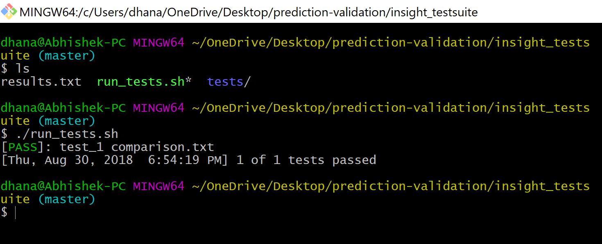

# INSIGHT DATA SCIENCE - Prediction Validation 
## Coding Challenge, Abhishek Dhanasetty

Programming language used:
=================

 > Python 3.6.6

## Table of Contents:

1. Problem Statement
2. Introduction
3. Idea 
4. Testing
5. Results

### Problem Statement:

> We read two different files, one provides the actual value of each stock every hour and the second lists the predicted value of the various stock at a certain hour during the same time period.

> I am obtaining the `average error` by calculating the average difference between the actual stock prices and predicted values over a specified sliding time window.

### Introduction:

I have three input files `actual.txt`, `predicted.txt`, `window.txt` where,

 `actual.txt` is a time-ordered file listing the actual value of stocks at a given hour. 
 
 `predicted.txt` is a time-ordered file listing the predicted value of certain stocks at a given hour.

`window.txt` has the window size - in hours for which I am calculating the average error.

From the given input dataset, I am calculating the average error per time window.

### Idea:

1. Taking the window size into account, I returning the consecutive time window. For example, a sequence has `[1, 2, 3, 4, 5, 6]` and the window size is `3`. 
    > Consecutive time window are: (1, 2, 3), (2, 3, 4), (3, 4, 5), (4, 5, 6)

2. For each time window, I am slicing the actual and predicted dataset and comparing the two results and replacing the missing data with `no data present` for stock ID and `ignore` for the amount. After updating the predicted values for per window, it looks like.

    > ['1', 'ATAYJP', '25.71'] ['1', 'CMWTQH', '81.22'] ['1', 'HVIWZR', '22.80'] ['1', 'SLKWVA', '94.49'] ['2', 'ATAYJP', '29.92'] ['2', 'no data present', 'ignore'] ['2', 'HVIWZR', '22.06'] ['2', 'no data present', 'ignore'] ['3', 'ATAYJP', '21.84'] ['3', 'no data present', 'ignore'] ['3', 'HVIWZR', '22.36'] ['3', 'SLKWVA', '79.49']

3. Calculating average error for each window, by taking the sum of errors per window and dividing by the number of observations for that particular window ranged hours.

    > Average Error = Sum Of Errors /Count Of Total Errors

### Testing

1. Testing the code using the given test suite.

    

### Results

The results are stored in the output folder as comparison.txt
